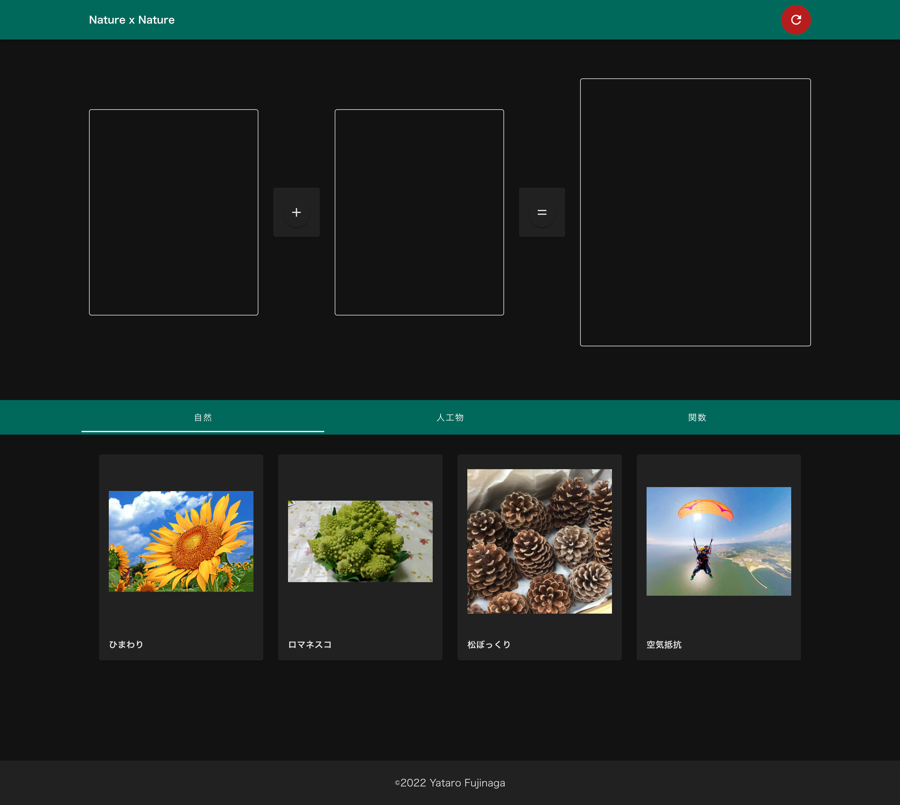
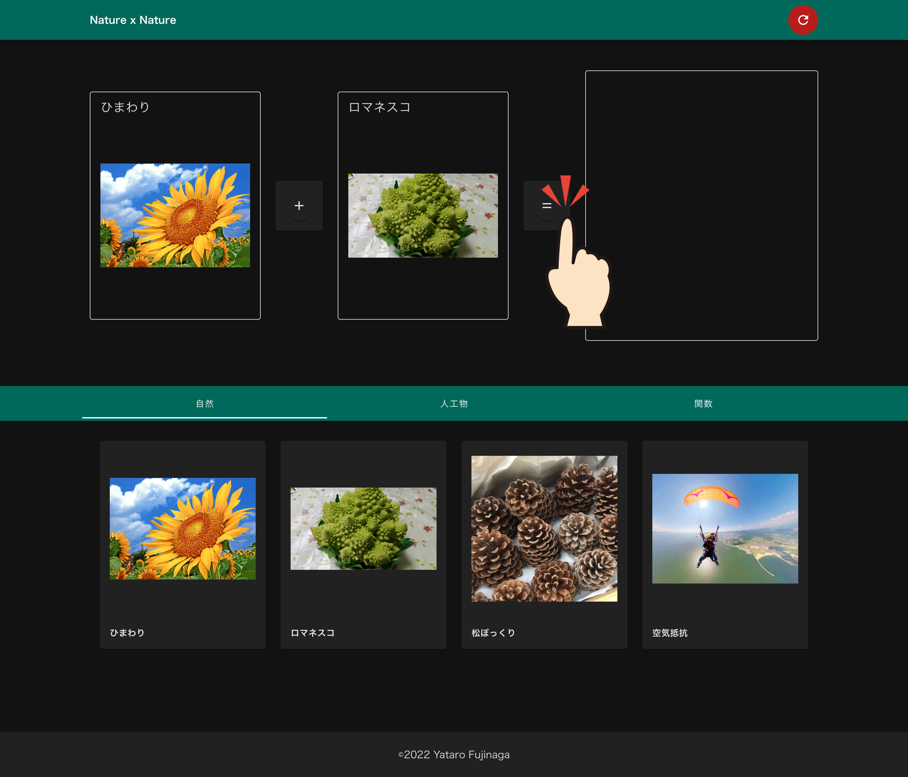
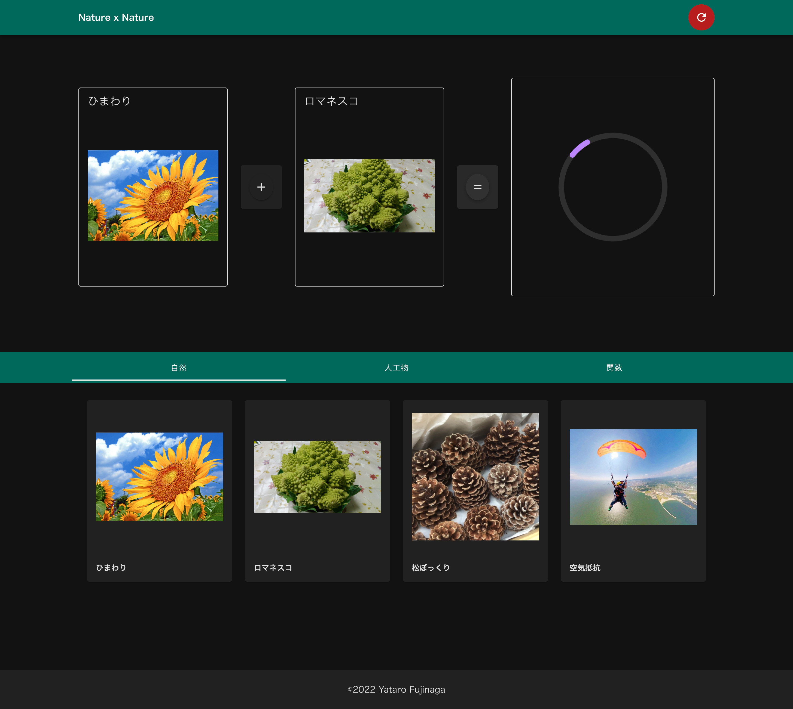
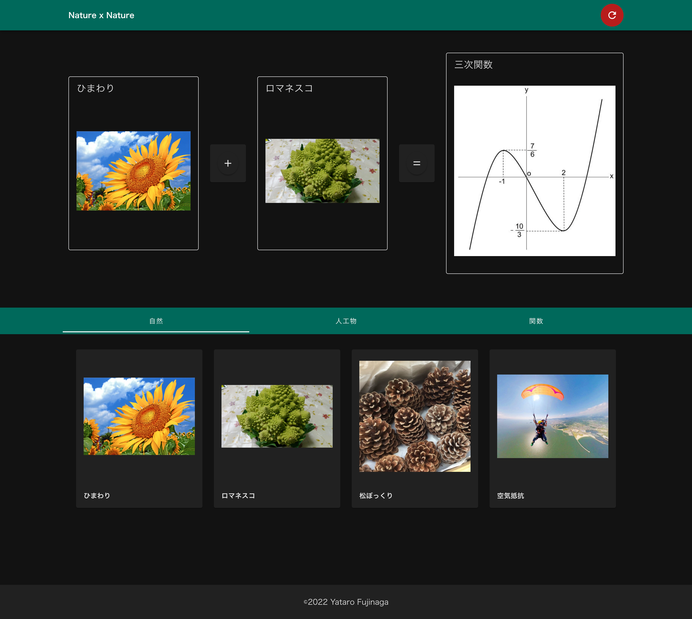
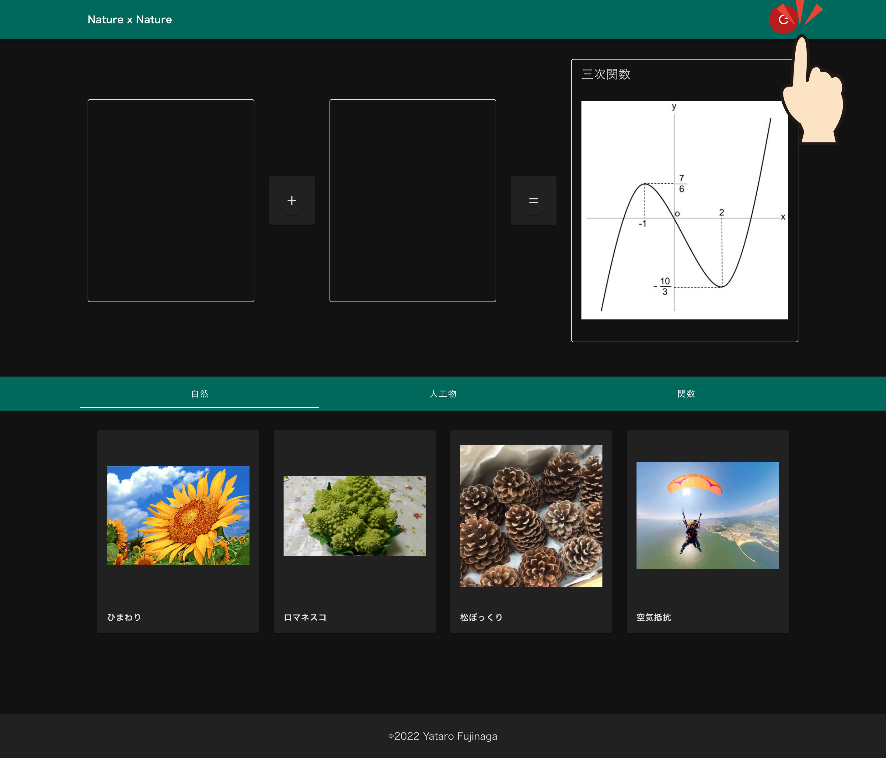

# Nature x Nature

2022 年度ディジタルコンテンツ演習で制作した作品です

## テーマ

科学は自然を数式を通して理解しようとする。

数式同士で演算が成立するなら　
自然同士であっても演算が成り立つと言えるのではないだろうか。

## 遊び方

写真を 2 つ選ぶ

写真が示す、自然現象やモノを表す数式が合成される

合成された数式に最も近い数式を計算する

その数式が表す自然現象やモノを写真として表示する

## 使い方

### 画像を選ぶ

計算させたい自然を 2 つ選びます。

### 等号のクリック

「等号」ボタンを押します。

### 計算中

### 計算結果

2 つの自然の計算から生まれた自然が表示されます。

### 計算のリセット

選んだ自然がリセットされます。

---
